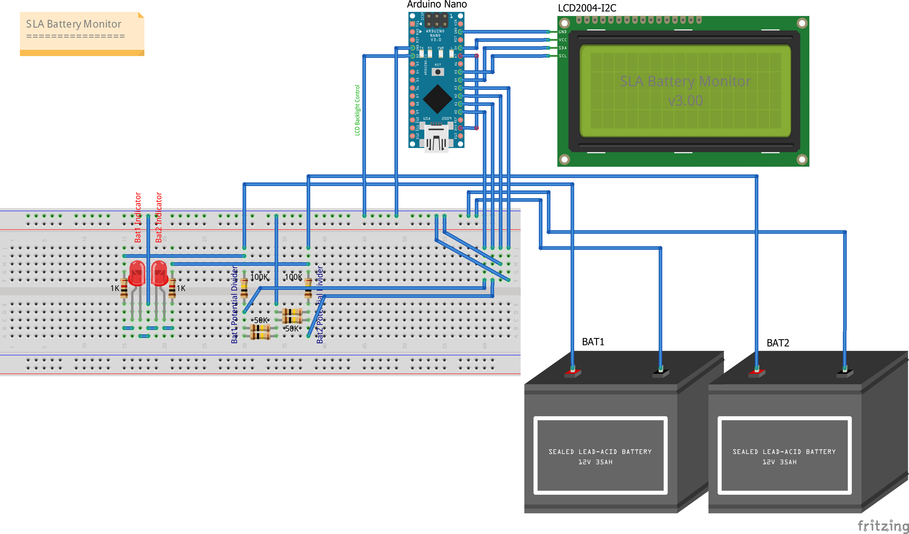
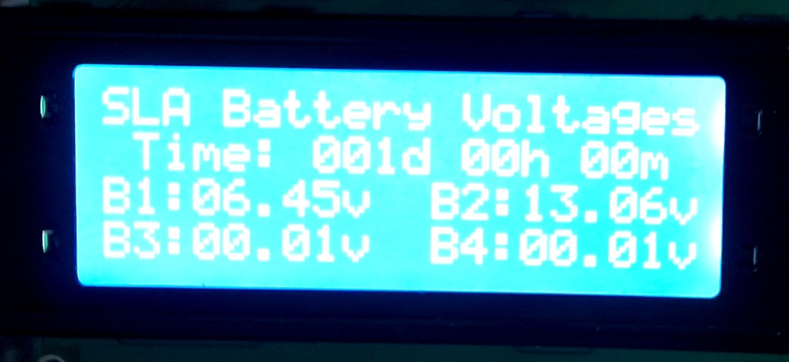
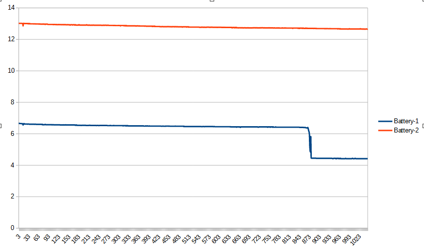
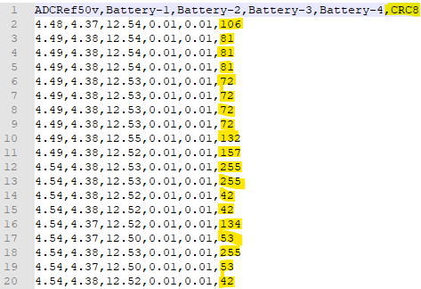

# SLABatMon
Testing and Monitoring some UPS 12v Sealed Lead Acid Batteries.

Recently one of my home UPS's started complaining about it's battery. I have a number of UPS's, so this is not a new thing, as on average a UPS battery has about a 3yr life. Anyway, this got me thinking, how do I know these batteries are bad and what makes a bad battery, bad?

Here is the simple hardware I built and the Arduino code I wrote to test and monitor these batteries, and my findings so far.

Bad battery characteristics I have found:
1. A 12v SLA car battery charger rejects it (fault light illuminated) and refuses to charge it.
2. When "fully charged", the battery voltage is less than 12.5v - 13.5v. My bad battery was a little over 11v when "fully charged".
3. After charging it does not hold the charge for long under little or no load. In less than 1 week my bad battery was down to under 5v!

My favourite part of the project was using the Arduino 3.3v supply as a reference voltage to calibrate the ADC measurements and voltage calculations. I also "discovered" the Fritzing... inexpensive and powerful software for documenting breadboard circuits.

You can see an explanation and demonstration here:
 - https://youtu.be/aRnLHJlChSg

## Fritzing hardware schematic:

## LCD display in action:

# Update 1
Some updates to my good and bad 12v SLA battery testing - battery discharge results and a code update.

Conclusions: My bad 12v batteries is terrible, and the USB power bus is anything but stable and predictable.

You can see these results discussed here:
 - https://youtu.be/0IxHjZJqgB4

## Batteries 1 & 2 - Discharge from full:

# Update 2
More updates to my good and bad 12v SLA battery testing - another code update.

Added a watchdog timer, and a CRC8 checksum to the serial console data stream... because it seems like a good idea if logs are going to be captured for an extended period of time. I have also documented the basic ADC formulas used in the code.

Additionally, I have written a small python script that can be used to check the CRC8 checksums in a text file of captured battery voltage data.

You can see this update discussed here:
 - https://youtu.be/Ctyt5gIIFC0

## Serial console results with a CRC8:

*********
**WARNING: 12v SLA batteries are powerful current sources. Do not take chances, but take care instead!**
*********
